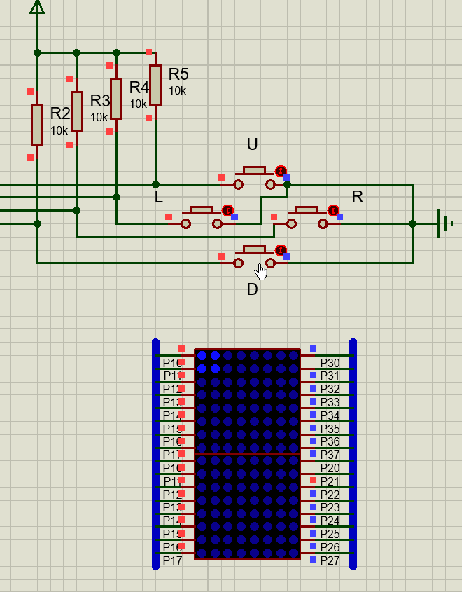
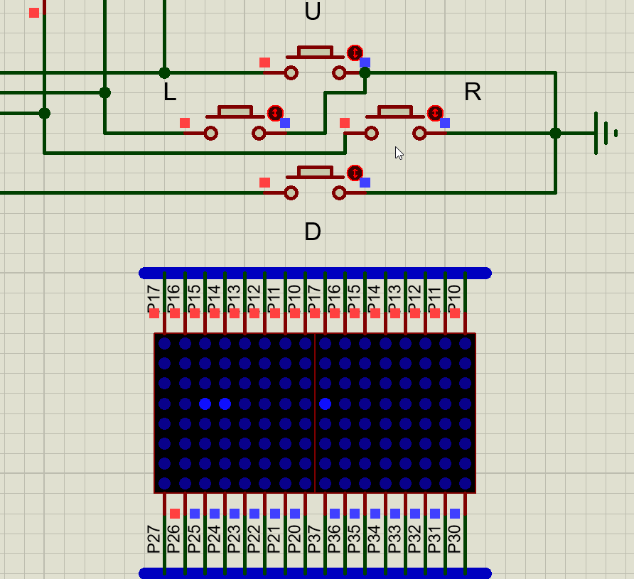

# USTC_VHDL

---

USTC 电子系统设计实验

## 实验环境

- VHDL 实验
  - Quartus II 13.0sp1
  - FPGA Cyclone 5 
- MCU 实验
  - Keil uVision5 C51
  - Proteus 8 Professional
- Typora 撰写报告和生成 pdf

## 实验内容

- 前五次为 VHDL 实验，工程文件为 Exp1 ~ Exp5
- 然后是 VHDL 自主设计实验，本工程设计了贪吃蛇和俄罗斯方块游戏，工程目录为 Gluttonous_Snake 和 Tetris，参见 [VHDL 自主设计实验](https://github.com/ustczwq/USTC_VHDL/blob/alpha/Reports/design/design.md)
- 接着是 MCU 两个小实验，基于 8051 单片机，目录为 MCU1 和 MCU2
- 最后是 MCU 自主设计综合实验，把 VHDL 实现的自主设计实验在 8051 上仿真再实现一遍，工程目录为 Snake_MCU 和 Tetris_MCU，参见 [8051 自主设计实验](https://github.com/ustczwq/USTC_VHDL/blob/alpha/Reports/8051/8051.md) 
- 所有实验报告，参见 Reports 目录

## 自主设计效果演示

### 1、VHDL FPGA 

### 2、8051 Proteus 仿真

## 已知问题

- VHDL 俄罗斯方块，到达底层旋转变形时可能会出现陷进去的错误

  > 8051 中已解决此 bug 因为 C 语言顺手就解决了，而不想再连接 FPGA 开发板调试，故 VHDL 工程残留 bug

- VHDL 有些语句不够精简，比如可以直接调库完成数据类型转化等

  > 这基本是因为没认真听讲和看 PPT

- FPGA 更适合于高并发任务，并不适合完成这种工程，本实验只当锻炼 VHDL

## 注意

- 抄袭代码可耻
- 工程性实验和卷面考试完全是两码事，重要的是学以致用