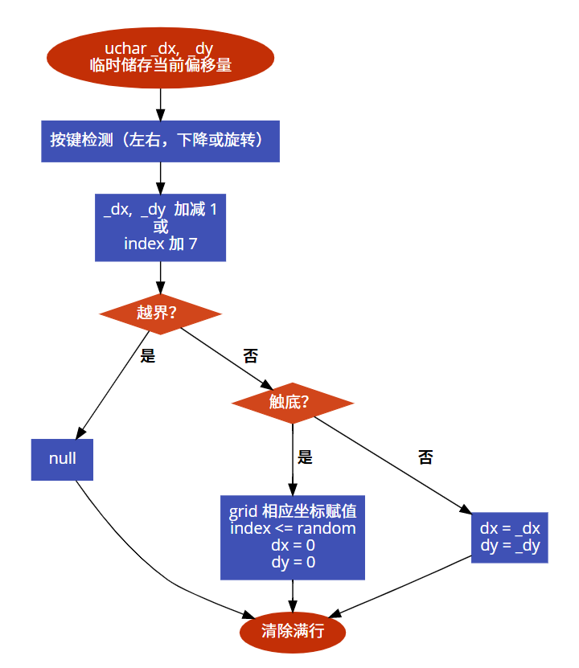
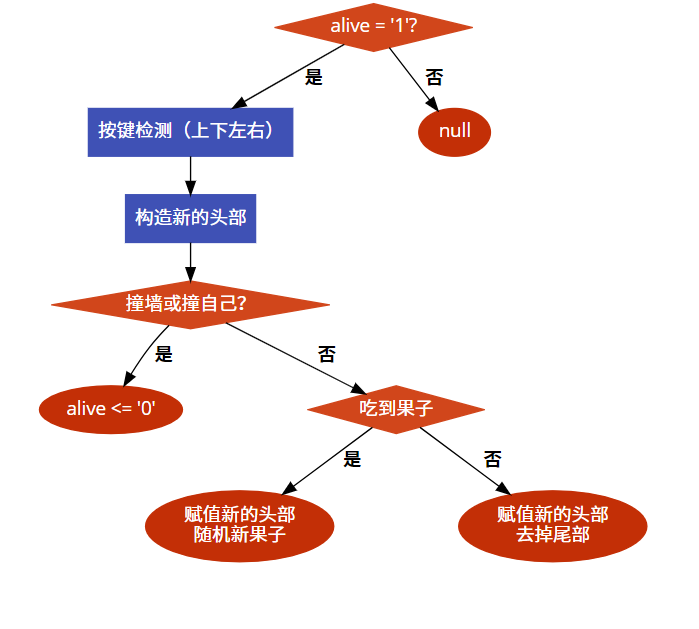

# 8051 自主设计实验——俄罗斯方块 + 贪吃蛇

---

#### 邹卫其 PB16061470


## 一、实验目的

### 1、俄罗斯方块

- 基于 8 x 16 （8 x 8 x 2）点阵屏显示
- 方块定时随机产生，每个方块占 4 个格点
- 可控制方块移动，包括左右、下降和旋转
- 满行可相消
- 可 reset 重新开始

## 2、贪吃蛇

- 基于 8 x 16 （8 x 8 x 2）点阵屏显示
- 可控制蛇上下左右移动
- 蛇吃每到一颗果实后长度加一
- 一颗果实被吃后，可随机产生新果实
- 可 reset 重新开始


## 二、设计思路

设计概图如下




- **扫描显示**：
  - 循环列选，对于每一列，根据点阵信息的全局变量，输出相应行选信号，控制点阵扫描显示
- **随机数产生**
  - 通过随机函数 rand() 再取模产生，由于随机种子一样，为了加大随机性，将每次随机结果与用户操作进行关联，每次游戏随机结果差异性加大
- **按键扫描**
  - 获取四个按键（轻触开关）状态，返回相应值
- **核心控制**
  - 全局数组存储点阵网格状态
  - 接受按键状态，在每个游戏周期进行控制


## 三、具体实现

> 完整工程代码参见 GitHub [俄罗斯方块](https://github.com/ustczwq/USTC_VHDL/tree/alpha/Tetris_MCU)  和 [贪吃蛇](https://github.com/ustczwq/USTC_VHDL/tree/alpha/Snake_MCU) 
>
> 工程报告参见 [设计报告](https://github.com/ustczwq/USTC_VHDL/blob/alpha/Reports/design/design.md) (实验效果以动图显示)

### 1. 俄罗斯方块

#### 数据结构

- **grid\[16\]** ：一维数组储存点阵亮灭状态，每一列 8 个点亮灭用 uchar 的 8 个 bit 表示

  ```c
  uchar grid[16];
  ```

- **shape\[28\]\[4\]\[2\]**：*code 数据*，28 * 4 * 2 的三维数组，储存所有形状的方块坐标

  - 28 = 7 * 4，包含 7 种基本形状方块，和分别旋转 90、180、270 度对应的其它形状
  - 4 * 2 表示每个方块占四个格点，每个格点有 x、y 二维坐标；此坐标为当方块最贴近左上角时的坐标，代表*基准坐标*

  ```c
  uchar code shape[28][4][2] = {
    {{0, 0}, {0, 1}, {1, 0}, {1, 1}}, // 7 basic shapes
    {{0, 0}, {1, 0}, {2, 0}, {3, 0}},
    {{0, 0}, {0, 1}, {1, 1}, {2, 1}},
    {{1, 0}, {0, 1}, {1, 1}, {2, 1}},
    {{2, 0}, {0, 1}, {1, 1}, {2, 1}},
    {{0, 0}, {1, 0}, {1, 1}, {2, 1}},
    {{1, 0}, {2, 0}, {0, 1}, {1, 1}},

    {{0, 0}, {0, 1}, {1, 0}, {1, 1}}, // rotate 90  deg
    {{0, 0}, {0, 1}, {0, 2}, {0, 3}},
    {{1, 0}, {0, 0}, {0, 1}, {0, 2}},
    {{1, 1}, {0, 0}, {0, 1}, {0, 2}},
    {{1, 2}, {0, 0}, {0, 1}, {0, 2}},
    {{0, 1}, {0, 2}, {1, 0}, {1, 1}},
    {{0, 0}, {0, 1}, {1, 1}, {1, 2}},

    {{0, 0}, {0, 1}, {1, 0}, {1, 1}}, // rotate 180 deg
    {{0, 0}, {1, 0}, {2, 0}, {3, 0}},
    {{0, 0}, {1, 0}, {2, 0}, {2, 1}},
    {{0, 0}, {1, 0}, {2, 0}, {1, 1}},
    {{0, 0}, {1, 0}, {2, 0}, {0, 1}},
    {{0, 0}, {1, 0}, {1, 1}, {2, 1}},
    {{1, 0}, {2, 0}, {0, 1}, {1, 1}},

    {{0, 0}, {0, 1}, {1, 0}, {1, 1}}, // rotate 270 deg
    {{0, 0}, {0, 1}, {0, 2}, {0, 3}},
    {{0, 2}, {1, 0}, {1, 1}, {1, 2}},
    {{0, 1}, {1, 0}, {1, 1}, {1, 2}},
    {{0, 0}, {1, 0}, {1, 1}, {1, 2}},
    {{0, 1}, {0, 2}, {1, 0}, {1, 1}},
    {{0, 0}, {0, 1}, {1, 1}, {1, 2}},
};
  ```

- **index**：*uchar*，表示方块形状的下标索引

  ```c
  uchar index = 0;
  ```

- **dx，dy**：*uchar*，表示方块相对于基准坐标的偏移量

  ```c
  uchar dx = 0, dy = 0; 
  ```

- **U, L, R, D**：*sbit*，按键开关位，分别表示旋转、左、右、下

  ```c
  sbit U = P0 ^ 0;
  sbit L = P0 ^ 1;
  sbit R = P0 ^ 2;
  sbit D = P0 ^ 3;
  ```

#### 算法设计

##### 方块控制

- **索引**：shape 数组储存了所有方块的形状基准坐标，通过 index下标值可以确定对应的方块
- **移动**：dx，dy 储存了方块相对于基准坐标的偏移量，每次需要方块四格点坐标时，直接根据 *基准坐标 + 偏移量* 即可算出相应位置；因而，只需要对 dx，dy 进行加减即可轻松控制方块移动
- **旋转**：将方块下标索引值 + 7 即可；原因很简单，shape 数组存储 28 种所有形状时，先是 7 种基本形状然后对应旋转 90、180、270 度的分别排列，也就是说 index + 7 即对应旋转一次后的下标（当然这里 + 7 是取模意义下的，每旋转 4 次即还原）
- **产生**：只需要产生 0 ~ 27 的随机数即可，因为通过下标即可索引到方块

##### 随机数

- 先通过随机函数 rand() 再取模产生随机数，然后将随机数与用户操作关联，在主循环不断计算，需要时直接取出 random 值

  ```c
  void fakeRandom(void)
  {
      uint num = rand();
      num *= (ctrlCounter + 1);
      num += random;
      num += index;
      num += key;
      random = num % 28;
  }
  ```

##### 扫描显示

- 根据计数值获取当前列号，直接输出点阵数组所对应列下的行选信号，以此显示下端累积已固定的方块状态
- 同时，对于每次列选号，计算当前方块所占四个格点的坐标，如果格点在该列出现，则该点对应的行选赋值，即点亮正在下落的方块

##### 核心控制



### 2、贪吃蛇

#### 数据结构

- **grid\[16\]** ：一维数组储存点阵亮灭状态，每一列 8 个点亮灭用 uchar 的 8 个 bit 表示，同上

- **snake\[LEN\]**：一维数组储存蛇身每个点的坐标，uchar 8 位中，前四位表示 x 坐标，后四位表示 y 坐标；再配合 head、tail 的头尾索引，实现循环队列

  ```c
  #define LEN 80
  uchar snake[LEN];
  uchar head = 1;
  uchar tail = 0;
  ```

- **food**：*uchar*，记录果子位置，前四位表示 x 坐标，后四位表示 y 坐标

  ```c
  uchar food = 0x44;
  ```

- **alive**：*uchar*，记录是否存活，1 表示活，0 表示 game over

- **U, L, R, D**：*sbit*，按键开关位，分别表示上、左、右、下

  ```c
  sbit U = P0 ^ 0;
  sbit L = P0 ^ 1;
  sbit R = P0 ^ 2;
  sbit D = P0 ^ 3;
  ```

#### 算法设计

##### 蛇移控制

- 蛇的每次移动，其实等价于将尾格移动到头格，故只需要根据按键方向产生新的头部，再去掉尾部即可
- 通过循环队列，每次移动即是头部和尾部对应索引均 + 1，再把新的头部坐标装进数组
- 若吃到果子，则不需要去掉尾部，直接将果子位置赋成新的头部即可，再产生随机果子

##### 果子产生

- 同上，用一个进程不停计算并产生值，需要的时候再取值
- 略不同的是，需要确定果子不在蛇身再赋值

##### 核心逻辑




## 四、电路原理图

### 1. 俄罗斯方块


### 2. 贪吃蛇


## 五、硬件验证

完整动图效果可参见 GitHub [俄罗斯方块演示](https://github.com/ustczwq/USTC_VHDL/blob/alpha/Reports/design/tetris.gif) 和 [贪吃蛇演示](https://github.com/ustczwq/USTC_VHDL/blob/alpha/Reports/design/snake.gif)

### 1. 俄罗斯方块


### 2. 贪吃蛇


## 六、实验总结

- 本实验遵从自上向下的设计规范
  - 系统行为建模，解耦需求，设计功能模块和控制框图，进行抽象的层次化设计
  - 完成功能模块具体实现
  - 完成部分顶层实体仿真，和 RTL 仿真
  - 通过硬件验证，不断调试，达到一个较好的效果
- 实验数据结构和算法用 VHDL 实现有一定的繁琐，事实上，FPGA 适合于高并发等任务，本不适合拿来实现这种工程；但通过实验还是加深了对 VHDL 的理解和运用，同时锻炼了 FPGA 开发能力