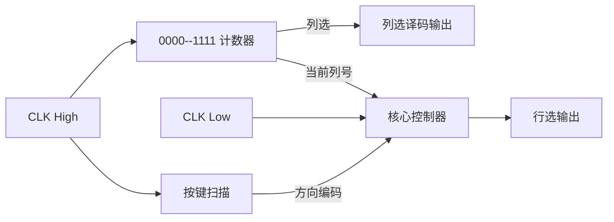

# VHDL 自主设计实验——俄罗斯方块 + 贪吃蛇

---

#### 邹卫其 PB16061470

## 一、实验目的

### 1、俄罗斯方块

- 基于 8 x 16 （8 x 8 x 2）点阵屏显示
- 方块定时随机产生，每个方块占 4 个格点
- 可控制方块移动，包括左右、下降和旋转
- 满行可相消
- 可 reset 重新开始

## 2、贪吃蛇

- 基于 8 x 16 （8 x 8 x 2）点阵屏显示
- 可控制蛇上下左右移动
- 蛇吃每到一颗果实后长度加一
- 一颗果实被吃后，可随机产生果实（蛇身之外）
- 可 reset 重新开始

## 二、设计思路

