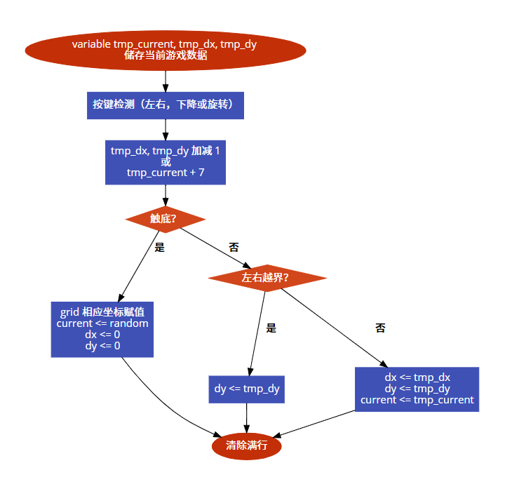
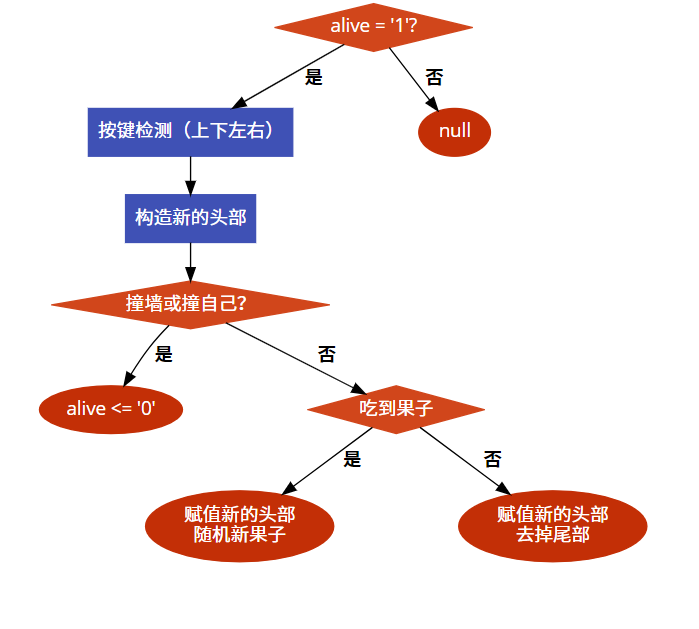
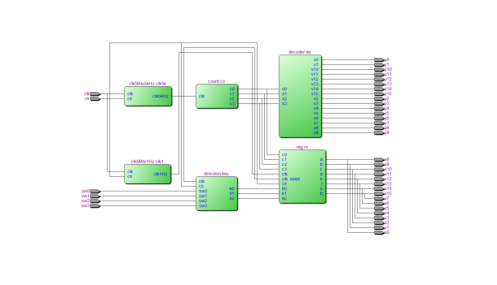
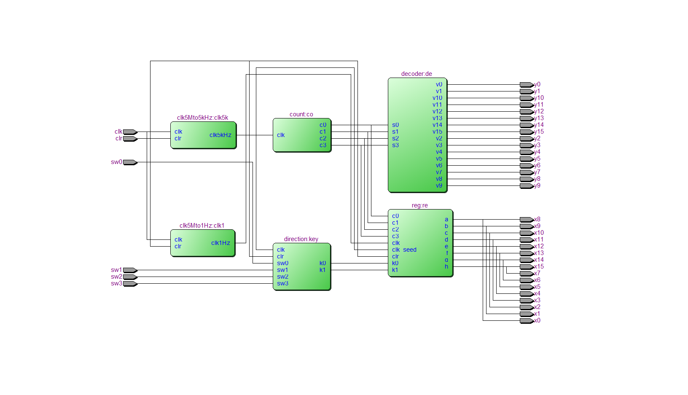

# VHDL 自主设计实验——俄罗斯方块 + 贪吃蛇

---

#### 邹卫其 PB16061470


## 一、实验目的

### 1、俄罗斯方块

- 基于 8 x 16 （8 x 8 x 2）点阵屏显示
- 方块定时随机产生，每个方块占 4 个格点
- 可控制方块移动，包括左右、下降和旋转
- 满行可相消
- 可 reset 重新开始

## 2、贪吃蛇

- 基于 8 x 16 （8 x 8 x 2）点阵屏显示
- 可控制蛇上下左右移动
- 蛇吃每到一颗果实后长度加一
- 一颗果实被吃后，可随机产生新果实
- 可 reset 重新开始


## 二、设计思路

设计思路框图如下




- **计数**：
  - 由*高速时钟*驱动，产生 0000~1111 循环计数，表示循环的列号
- **列选**
  - 通过计数器*译码输出*，进行 16 列的列选信号输出
- **按键扫描**
  - 由高速时钟驱动，获取四个按键（轻触开关）状态，进行*方向编码*
- **核心控制器**
  - 在*低速时钟*的每个周期内，接收方向编码进行*核心控制*，并锁存游戏数据
  - 锁存 16x8 点阵状态，并根据当前计数值，输出该列号对应的行选信号，完成扫描显示


## 三、具体实现

>  完整工程代码参见 GitHub [俄罗斯方块](https://github.com/ustczwq/USTC_VHDL/tree/alpha/Tetris)  和 [贪吃蛇](https://github.com/ustczwq/USTC_VHDL/tree/alpha/Gluttonous_Snake) 
>
>  工程报告参见 [设计报告](https://github.com/ustczwq/USTC_VHDL/blob/alpha/Reports/design/design.md) (实验效果以动图显示)


### 1. 俄罗斯方块

#### 数据结构

- **grid** ：*signal*，16 * 8 二维数组，储存点阵亮灭状态

  ```vhdl
  type t_column is array (0 to 7)  of std_logic;   -- grid: (width, height) = (16, 8)
  type t_grid   is array (0 to 15) of t_column;
  signal grid   :t_grid;
  ```

- **shapes**：*constant*，28 * 4 * 2 的三维数组，储存所有形状的方块坐标

  - 28 = 7 * 4，包含 7 种基本形状方块，和分别旋转 90、180、270 度对应的其它形状
  - 4 * 2 表示每个方块占四个格点，每个格点有 x、y 二维坐标；此坐标为当方块最贴近左上角时的坐标，代表*基准坐标*

  ```vhdl
  type t_position is array (0 to 1)  of integer;   -- position: (x, y), range (0, 0) to (15, 7)
  type t_shape    is array (0 to 3)  of t_position;
  type t_shapes   is array (0 to 27) of t_shape;
  constant shapes :t_shapes := (
  		((0, 0), (0, 1), (1, 0), (1, 1)), 	-- 7 basic shapes   
  	    ((0, 0), (1, 0), (2, 0), (3, 0)),	 
  		((0, 0), (0, 1), (1, 1), (2, 1)), 
  		((1, 0), (0, 1), (1, 1), (2, 1)),
  		((2, 0), (0, 1), (1, 1), (2, 1)),
  		((0, 0), (1, 0), (1, 1), (2, 1)),
  		((1, 0), (2, 0), (0, 1), (1, 1)),
  		
  		((0, 0), (0, 1), (1, 0), (1, 1)),	-- rotate 90  deg   
  		((0, 0), (0, 1), (0, 2), (0, 3)), 
  		((1, 0), (0, 0), (0, 1), (0, 2)), 
  		((1, 1), (0, 0), (0, 1), (0, 2)), 
  		((1, 2), (0, 0), (0, 1), (0, 2)), 
  		((0, 1), (0, 2), (1, 0), (1, 1)),
  		((0, 0), (0, 1), (1, 1), (1, 2)),
  		
  		((0, 0), (0, 1), (1, 0), (1, 1)), 	-- rotate 180 deg  
  	    ((0, 0), (1, 0), (2, 0), (3, 0)),
  		((0, 0), (1, 0), (2, 0), (2, 1)),
  		((0, 0), (1, 0), (2, 0), (1, 1)),
  		((0, 0), (1, 0), (2, 0), (0, 1)),
  		((0, 0), (1, 0), (1, 1), (2, 1)),
  		((1, 0), (2, 0), (0, 1), (1, 1)),
  		
  		((0, 0), (0, 1), (1, 0), (1, 1)),	-- rotate 270  deg   
  		((0, 0), (0, 1), (0, 2), (0, 3)), 
  		((0, 2), (1, 0), (1, 1), (1, 2)),
  		((0, 1), (1, 0), (1, 1), (1, 2)),
  		((0, 0), (1, 0), (1, 1), (1, 2)),
  		((0, 1), (0, 2), (1, 0), (1, 1)),
  		((0, 0), (0, 1), (1, 1), (1, 2))
  	);
  ```

- **current**：*signal*，整型，表示方块形状的下标索引

  ```vhdl
  signal current :integer range 0 to 27 := 0;
  ```

- **dx，dy**：*signal*，整形，表示方块相对于基准坐标的偏移量

  ```vhdl
  signal dx :integer range 0 to 7  := 0;
  signal dy :integer range 0 to 15 := 0; 
  ```

#### 算法设计

##### 方块控制
- **索引**：shapes 数组储存了所有方块的形状基准坐标，通过 current 下标值可以确定对应的方块
- **移动**：dx，dy 储存了方块相对于基准坐标的偏移量，每次需要方块四格点坐标时，直接根据 *基准坐标 + 偏移量* 即可算出相应位置；因而，只需要对 dx，dy 进行加减即可轻松控制方块移动
- **旋转**：将方块下标索引值 + 7 即可；原因很简单，shapes 数组存储 28 种所有形状时，先是 7 种基本形状然后对应旋转 90、180、270 度的分别排列，也就是说 current + 7 即对应旋转一次后的下标（当然这里 + 7 是取模意义下的，每旋转 4 次即还原）
- **产生**：只需要产生 0 ~ 27 的随机数即可，因为通过下标即可索引到方块

##### 随机数

- 实现好的随机较难，这里通过高速进程对一个值不停进行计算，其它进程需要的时候取出该值，因为需要取值的时间间隔较为随机，故 random 值较为随机

  ```vhdl
  seed: process(clk_seed)
  begin
  	if clk_seed'event and clk_seed = '1' then
  		random  <= (random  + 5) rem 28;
  	end if;
  end process seed;
  ```

##### 扫描显示

- 根据计数值获取当前列号，直接输出点阵数组所对应列下的行选信号，以此显示下端累积已固定的方块状态
- 同时，对于每次列选号，计算当前方块所占四个格点的坐标，如果格点在该列出现，则该点对应的行选赋值，即点亮正在下落的方块

##### 核心控制



### 2、贪吃蛇

#### 数据结构

- **grid** ：*signal*，16 * 8 二维数组，储存点阵亮灭状态，同上

- **snake**：signal，128 * 2 二维数组，储存蛇身每个点的二维坐标，再配合 head、tail 的头尾索引，实现循环队列

  ```vhdl
  type t_position is array (0 to 1) of integer;
  type t_snake    is array (0 to 127) of t_position;
  signal snake :t_snake;
  	
  signal head  :integer range 0 to 127;
  signal tail  :integer range 0 to 127;
  ```

- **alive**：*signal*，*std_logic*，记录是否存活，‘1’ 表示活，‘0’ 表示 game over

  ```vhdl
  signal alive :std_logic := '1';
  ```

#### 算法设计

##### 蛇移控制

- 蛇的每次移动，其实等价于将尾格移动到头格，故只需要根据按键方向产生新的头部，再去掉尾部即可
- 通过循环队列，每次移动即是头部和尾部对应索引均 + 1，再把新的头部坐标装进数组
- 若吃到果子，则不需要去掉尾部，直接将果子位置赋成新的头部即可，再产生随机果子

##### 果子产生

- 同上，用一个进程不停计算并产生值，需要的时候再取值
- 略不同的是，需要确定果子不在蛇身再赋值

##### 核心逻辑




## 四、RTL 电路

### 1. 俄罗斯方块



### 2. 贪吃蛇



可以看到 RTL 仿真结果，完全符合上述设计思路框图


## 五、硬件验证

完整动图效果可参见 GitHub [俄罗斯方块演示](https://github.com/ustczwq/USTC_VHDL/blob/alpha/Reports/design/tetris.gif) 和 [贪吃蛇演示](https://github.com/ustczwq/USTC_VHDL/blob/alpha/Reports/design/snake.gif)

### 1. 俄罗斯方块


### 2. 贪吃蛇


## 六、实验总结

- 本实验遵从自上向下的设计规范
  - 系统行为建模，解耦需求，设计功能模块和控制框图，进行抽象的层次化设计
  - 完成功能模块具体实现
  - 完成部分顶层实体仿真，和 RTL 仿真
  - 通过硬件验证，不断调试，达到一个较好的效果
- 实验数据结构和算法用 VHDL 实现有一定的繁琐，事实上，FPGA 适合于高并发等任务，本不适合拿来实现这种工程；但通过实验还是加深了对 VHDL 的理解和运用，同时锻炼了 FPGA 开发能力