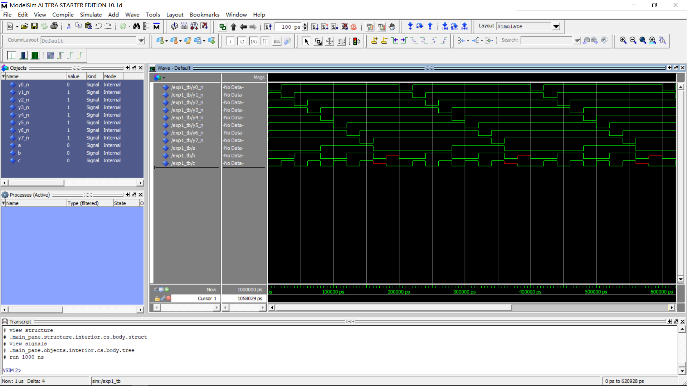

## 实验一、Altera FPGA 开发入门

---

###### 邹卫其 PB16061470


#### 一、实验内容

- Altera FPGA 开发入门实验，熟悉 Altera FPGA 开发环境、设计步骤和流程

- 用 FPGA VHDL 实现 3-8 译码器设计，并进行硬件验证

  

#### 二、设计分析

##### 3-8 译码器

- 三位输入（每位 0 or 1） 组成三位二进制数，分别对应八位输出
- 通过 case - when 语句完成上述输出选择

##### 硬件验证

- 三位输入对应三个拨码开关，每个开关控制输入 0 或1

- 八位输出对应八个 LED，LED 亮暗对应输出 0 或 1

  

#### 三、源代码

##### 顶层实体 Exp1.vhd

```vhdl
library ieee;
use ieee.std_logic_1164.all;

entity Exp1 is
    port(
        y0_n, y1_n, y2_n, y3_n, y4_n, y5_n, y6_n, y7_n :out std_logic;
        a, b, c :in std_logic
    );
end Exp1;

architecture behave of Exp1 is
    signal abc :std_logic_vector(2 downto 0);
begin
    abc <= a & b & c;
    process(abc) 
    begin
        y0_n <= '1';
        y1_n <= '1';
        y2_n <= '1';
        y3_n <= '1';
        y4_n <= '1';
        y5_n <= '1';
        y6_n <= '1';
        y7_n <= '1';
		 case abc is 
			  when "000" =>
					y0_n <= '0';
			  when "001" =>
					y1_n <= '0';
			  when "010" =>
					y2_n <= '0';
			  when "011" =>
					y3_n <= '0';
			  when "100" =>
					y4_n <= '0';
			  when "101" =>
					y5_n <= '0';
			  when "110" =>
					y6_n <= '0';
			  when "111" =>
					y7_n <= '0';
			  when others =>
					null;
		 end case;
	end process;
end behave;

```

##### 激励文件 Exp1_tb.vhd

```vhdl
library ieee;
use ieee.std_logic_1164.all;

entity Exp1_tb is
end Exp1_tb;

architecture arch_tb of Exp1_tb is
    component Exp1 is
    port(
        y0_n, y1_n, y2_n, y3_n, y4_n, y5_n, y6_n, y7_n :out std_logic;
        a, b, c :in std_logic
    );
    end component;

    signal y0_n, y1_n, y2_n, y3_n, y4_n, y5_n, y6_n, y7_n : std_logic;
    signal a,b, c : std_logic := '0';

begin
    u_tb :Exp1 port map(
        y0_n, y1_n, y2_n, y3_n, y4_n, y5_n, y6_n, y7_n,
        a, b, c);

    process
    begin
        a <= '0';
        b <= '0';
        c <= '0';
        wait for 20 ns;
        a <= '0';
        b <= '0';
        c <= '1';
        wait for 20 ns;
        a <= '0';
        b <= '1';
        c <= '0';
        wait for 20 ns;
        a <= '0';
        b <= '1';
        c <= '1';
        wait for 20 ns;
        a <= '1';
        b <= '0';
        c <= '0';
        wait for 20 ns;
        a <= '1';
        b <= '0';
        c <= '1';
        wait for 20 ns;
        a <= '1';
        b <= '1';
        c <= '0';
        wait for 20 ns;
        a <= '1';
        b <= '1';
        c <= '1';
        wait for 20 ns;
        a <= '0';
        b <= '0';
        c <= 'X';
        wait for 20 ns;
        a <= '0';
        b <= 'U';
        c <= '0';
        wait for 20 ns;
    end process;
end arch_tb;
```


#### 四、仿真结果





#### 五、验证结果

- 三个拨码开关分别输入 000 至 111，八位输出分别唯一对应一个 LED 灯，通过 3 位输入可以控制八位输出，可见 3-8 译码成功


#### 六、实验总结

- 本次实验没有逻辑上的难度，主要是熟悉了 Altera FPGA 开发环境和流程
- 了解了 Quartus 开发配置、工程结构和硬件连接，为后面较复杂的实验做铺垫

```

```