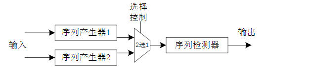
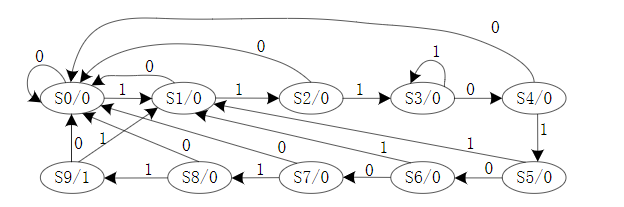
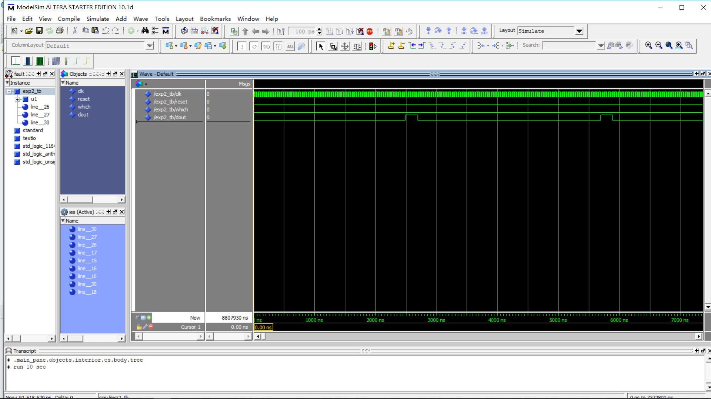
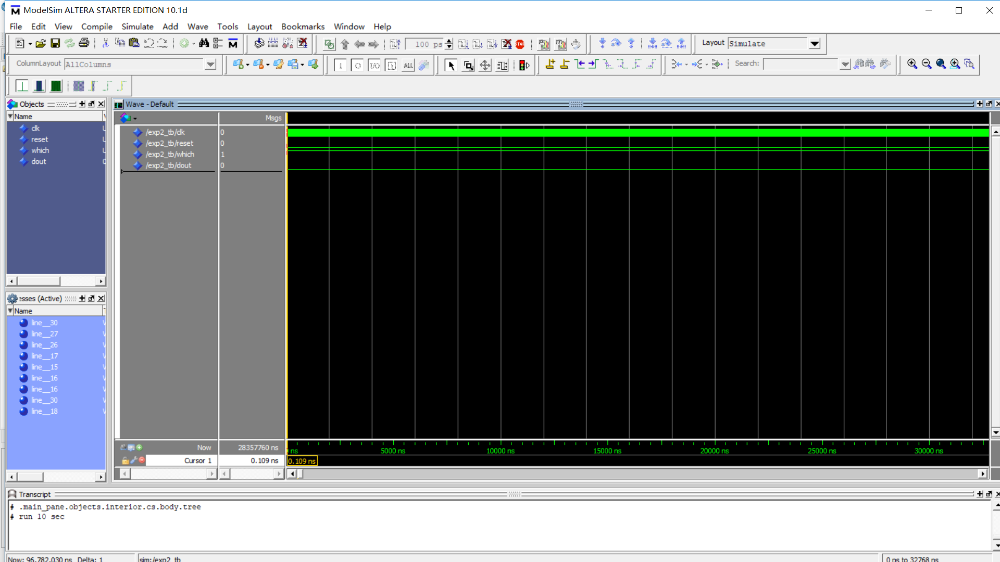
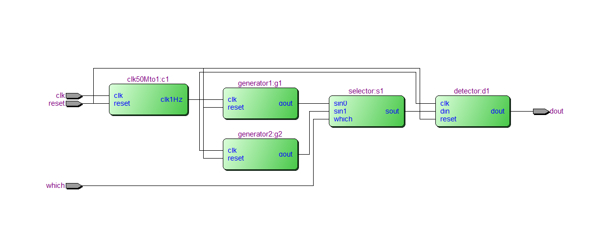

## 实验二、序列检测器设计

------

###### 邹卫其 PB16061470


#### 一、实验目的

- 熟悉并掌握信号发生器的原理与设计
- 熟悉并掌握状态机的原理与设计
- 熟悉并掌握序列检测器的原理与设计
- 熟悉并掌握 VHDL 中元件及其例化
- 进一步掌握 Altera FPGA 设计的流程和步骤


#### 二、实验内容



- 完成两个序列发生器，产生的序列一个包含待检验序列（‘111010011’），另一个不包含

- 完成序列检测器，检测到序列 ‘111010011’ 则输出 ‘1’，否则输出 ‘0’

- 通过二选一选择输入的序列，分别检验结果

  

#### 三、设计分析

##### 序列检测器



- 根据状态转移图，设计有限状态机，检测到信号时进行状态转移，当且仅当到达状态 S9 时，输出 ‘1’，即检测到 ‘111010011’ 序列

##### 序列发生器

- 设计有限状态机，循环遍历状态，每个状态同时输出相应值，即可产生相应序列

  

#### 四、源代码

##### 顶层实体 Exp2.vhd

```vhdl
library ieee;
use ieee.std_logic_1164.all;

entity Exp2 is
	port( 
		clk, reset :in  std_logic;
		which :in  std_logic;
		dout  :out std_logic
	);
end Exp2;

architecture whole of Exp2 is
	component clk50Mto1 is
		port(
			clk    :in std_logic;
			reset  :in std_logic;
			clk1Hz :out std_logic 
		);
	end component;

	component generator1 is
		port(
			clk, reset :in  std_logic;
			gout       :out std_logic
		);
   end component;
	
	component generator2 is
		port(
			clk, reset :in  std_logic;
			gout       :out std_logic
		);
   end component;
	
	component selector is
		port(
			sin0 :in std_logic;
			sin1 :in std_logic;
			which :in std_logic;
			sout :out std_logic
		);
   end component;
	
	component detector is
		port(
			clk, reset :in std_logic;
			din  :in  std_logic;
			dout :out std_logic
		);
   end component;
	
	signal clk1Hz : std_logic;
	signal din    : std_logic;
	signal sin0   : std_logic;
	signal sin1   : std_logic;
	
begin
	c1: clk50Mto1 port map(
		clk => clk,
		reset  => reset,
		clk1Hz => clk1Hz
	);
	
	g1 :generator1 port map(
		clk => clk1Hz, reset => reset,
      gout => sin0
	);
		
	g2 :generator2 port map(
		clk => clk1Hz, reset => reset,
      gout => sin1
	);
		
	s1 :selector port map(
		sin0 => sin0,
		sin1 => sin1,
		which => which,
		sout  => din
	);
	
	d1 :detector port map(
		clk => clk1Hz, reset => reset,
		din  => din,
		dout => dout
	);
end whole;


```

##### 激励文件 Exp2_tb.vhd

```vhdl
library ieee;
use ieee.std_logic_1164.all;

entity Exp2_tb is
end Exp2_tb;

architecture arch_tb of Exp2_tb is
	component Exp2 is
   port(
		clk, reset :in  std_logic;
		which :in  std_logic;
		dout  :out std_logic
	);
   end component;

   signal clk, reset : std_logic;
	signal which : std_logic;
	signal dout  : std_logic;

begin
   u1 :Exp2 port map(
		clk, reset,
		which,
      dout);
		  
	reset <= '0';
	which <= '0';
	
	process
	begin
		clk <= '0';
		wait for 10 ns;
		clk <= '1';
		wait for 10 ns;
	end process;
end arch_tb;
```


##### 完整源码参见  [GitHub Exp2](https://github.com/ustczwq/USTC_VHDL/tree/master/Exp2)


#### 五、仿真结果

为便于观看仿真结果，已调整时钟

##### 检测到序列




##### 未检测到序列




##### RTL 电路图



#### 六、验证结果

- 通过拨码开关切换两个输入，包含待测序列的输出 LED 周期闪烁；另一个则 LED 常灭，故序列检测成功


#### 六、实验总结

- 本次实验结构较为复杂，从原理上讲，检测和产生序列本质都是有限状态的转移和输出
- 从实现上讲，要有模块化开发思想，减少模块功能耦合，逐一调试完毕，再进行总的元件例化
- 进一步了解了 Quartus 开发配置、工程结构和硬件连接
