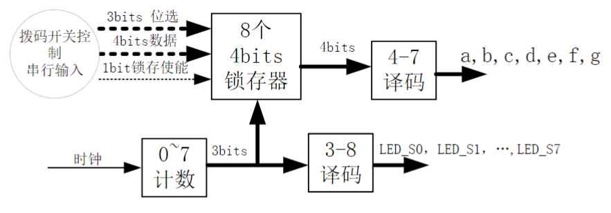
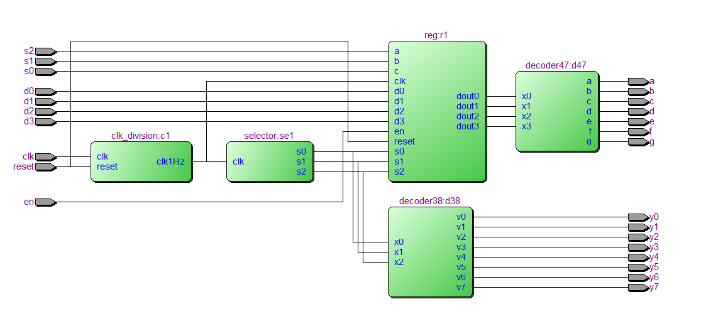
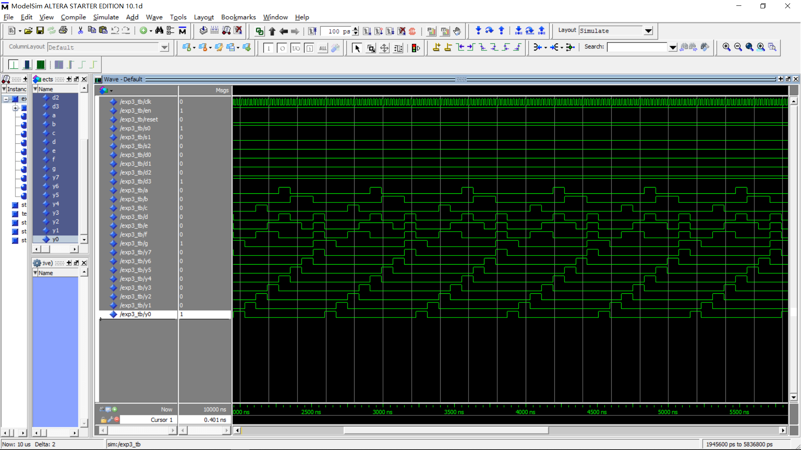

# 实验三、七段数码管动态显示电路设计

---

#### 邹卫其 PB16061470


## 一、实验目的

- 熟悉 8 位七段数码管动态显示的控制
- 熟练掌握 VHDL test bench（测试平台/测试激励）的编写和仿真流程
- 熟练掌握 Altera FPGA 的开发环境、设计步骤和流程


## 二、实验内容

- 用 VHDL 设计一个电路，实现在 8 位七段数码管上同时显示不同的数据（0~9， A~F）。而且要求可以通过拨码开关控制在不同的数码管上显示不同的数
- 编写 VHDL test bench，设置相关参数，完成功能仿真
- 查看 RTL 级的电路原理图
- 完成管脚分配
- 实现硬件验证


## 三、设计分析

### 数码管正极端控制

在 8 位七段数码管上同时显示不同的数据，则要 4*8bits 数据，采用拨码开关从 FPGA 外部并行输入。输入数据时要在设计中锁存。指定或输入锁存的数据由计数器来选择 8 个中的一个，在经过 4-7 译码后给 a, b, c, d, e, f, g。

### 数码管负极端控制

8 位七段数码管共有 8 个共阳极端（LED_S0~7），其控制来自于 0~7 计数值经 3-8 译码后的输出。

### 整体设计框图

<div align='center'>
    
</div>


## 四、VHDL 源码

### 锁存器 entity reg

- 二维数组锁存每个数码管显示数据

- 通过三位片选数据选定二维数组下标，进行数码管索引
- 通过四位数值的赋值，锁存该数码管的显示数据

```vhdl
library ieee;
use ieee.std_logic_1164.all;

entity reg is 
	port(
		clk, en, reset, a, b, c :in std_logic;
		s0, s1, s2     :in std_logic;
		d0, d1, d2, d3 :in std_logic;
		dout0, dout1, dout2, dout3 :out std_logic 
	);
end reg;

architecture behave of reg is
	signal counter :integer range 0 to 7;
	type data is array (3 downto 0) of std_logic;
	type data_reg is array (0 to 7) of data;
	signal dreg :data_reg := ("0000", "0001", "0010", "0011", "0100", "0101", "0110", "0111");
	
begin	
	reg: process(reset, a, b, c, d0, d1, d2, d3)
		variable num :integer range 0 to 15;
	begin
		if reset = '1' then
			dreg <= ("0000", "0001", "0010", "0011", "0100", "0101", "0110", "0111");
		elsif en = '1' then
			num := 0;
			if a = '1' then
				num := num + 4;
			end if;
			if b = '1' then
				num := num + 2;
			end if;
			if c = '1' then
				num := num + 1;
			end if;
			dreg(num)(0) <= d0;
			dreg(num)(1) <= d1;
			dreg(num)(2) <= d2;
			dreg(num)(3) <= d3;
		end if;
	end process reg;
	
	output: process(clk, s0, s1, s2)
		variable slct :integer range 0 to 7;
	begin
		slct := 0;
		if s2 = '1' then
			slct := slct + 4;
		end if;
		if s1 = '1' then
			slct := slct + 2;
		end if;
		if s0 = '1' then
			slct := slct + 1;
		end if;
		dout0 <= dreg(slct)(0);
		dout1 <= dreg(slct)(1);
		dout2 <= dreg(slct)(2);
		dout3 <= dreg(slct)(3);
	end process output;
end behave;

```

### 47 译码器 entity decoder47

- 根据 4 位数值，译码为七段显示表
- 用 constant 储存七段表，减少器件消耗
- 二位数组索引选定七段值

```vhdl
library ieee;
use ieee.std_logic_1164.all;

entity decoder47 is
	port(
		x3, x2, x1, x0 :in std_logic;
		a, b, c, d, e, f, g :out std_logic
	);
end decoder47;

architecture output of decoder47 is
	type num  is array (6 downto 0) of std_logic;
	type nums is array (0 to 15) of num;
	constant data :nums := (
			"1000000",
			"1111001",
			"0100100",
			"0110000",
			"0011001",
			"0010010",
			"0000010",
			"1111000",
			"0000000",
			"0010000",
			"1000000",
			"1111001",
			"0100100",
			"0110000",
			"0011001",
			"0010010"
		);
	
begin
	process(x3, x2, x1, x0)
		variable tmp_num :integer range 0 to 15;
	begin
		tmp_num := 0;
		if x3 = '1' then
			tmp_num := tmp_num + 8;
		end if;
		if x2 = '1' then
			tmp_num := tmp_num + 4;
		end if;
		if x1 = '1' then
			tmp_num := tmp_num + 2;
		end if;
		if x0 = '1' then
			tmp_num := tmp_num + 1;
		end if;
		a <= data(tmp_num)(0);
		b <= data(tmp_num)(1);
		c <= data(tmp_num)(2);
		d <= data(tmp_num)(3);
		e <= data(tmp_num)(4);
		f <= data(tmp_num)(5);
		g <= data(tmp_num)(6);
	end process;
end output;

```

### 完整源码

- 其它实体较为平凡
- 完整源码详见：[GitHub VHDL Exp3](<https://github.com/ustczwq/USTC_VHDL/tree/master/Exp3>)


## 五、仿真结果

### RTL 电路

- 电路功能符合设计要求

<div align='center'>
    
</div>


### ModelSim 仿真

- 片选信号正常循环，可以扫描片选数码管
- 七段表正常译码，正常显示
- 通过改输入信号重新仿真，可以改变七段表数据，可以正常锁存

<div align='center'>
    
</div>


## 六、FPGA 硬件验证

- 可以控制每个数码管显示任意数，如下图

<div align='center'>
    
</div>

