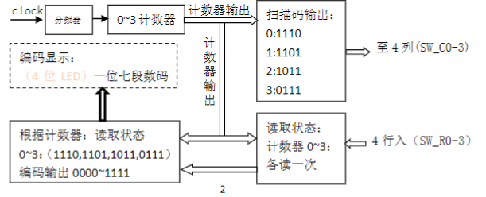

# 实验四、矩阵键盘扫描

---

#### 邹卫其 PB16061470


## 一、实验内容

- 进一步学习并掌握 Quartus II 设计的方法及步骤
- 熟悉 VHDL 语言电路设计方法
- 熟悉 VHDL test bench 的设计
- 学习并掌握利用 VHDL 描述并设计电路的方法和步骤
- 学习并掌握键盘阵列的扫描输入的方法及实现过程


## 二、实验原理

4 X 4 矩阵键盘硬件连接如下：


其中 +3V3 为 3.3V 的正电源；BUTTON 为 4×4 共 16 个按键，R 为电阻。而SW_R0/1/2/3 为按键阵列连接到 FPGA 通用 IO 引脚的行控制信号；SW_C0/1/2/3 为按键阵列连接到 FPGA 通用 IO 引脚的列控制信号。

通过对 4×4 键盘阵列的 4 个列控制信号循环输出 ”1110、1101、1011、0111”，来驱动键盘阵列，每输出一个列序列紧接着读取相应的 4 个行信号。通过读取的数据或状态来判断 16 个按键中哪个键被按下，并对其状态做编码输出。此电路不停的工作，以便实时准确地获取键盘的输入状态，以供其它电路使用，从而实现了键盘阵列的扫描输入。


## 三、设计分析



矩阵键盘扫描设计如上图，设计思路如下：

- 通过计数器不断产生 0 - 3 计数信号（2 进制），每一次计数输出，对应扫描一列；
- 扫描每一列时，将且仅将该列选信号赋 0，其他列赋 1
- 同时检查行信号，即可获得此列按键情况
- 将按键状态对应 0000 - 1111 (二进制下) 十六个值，进行编码和译码输出
- 通过不断扫描获取整个矩阵键盘的按键情况
- 特别地，我设计了数据锁存，当没按键按下时不进行赋值，保证数据可读性


## 四、源码

### count 计数

```vhdl
library ieee;
use ieee.std_logic_1164.all;

entity count is
	port (
		clk: in std_logic;
		s1, s0 :out std_logic := '0'
	);
end entity;

architecture behave of count is
	signal counter :integer range 0 to 3 := 0;
	
begin 
	process(clk)
	begin
		if clk'event and clk = '1' then				
			counter <= (counter + 1) rem 4;
			case counter is
				when 0 => s1 <= '0'; s0 <= '0';
				when 1 => s1 <= '0'; s0 <= '1';
				when 2 => s1 <= '1'; s0 <= '0';
				when 3 => s1 <= '1'; s0 <= '1';
				when others => null;
			end case;
		end if;
	end process;
end behave;
```

### out_decode 译码输出

```vhdl
library ieee;
use ieee.std_logic_1164.all;

entity out_decode is
	port (
		s3, s2, s1, s0 :in std_logic;
		a, b, c, d, e, f, g :out std_logic
	);
end entity;

architecture behave of out_decode is
	type num  is array (0 to 6) of std_logic;
	type nums is array (0 to 15) of num;
	constant data :nums := (
		"1001111", --'1'
		"1001100", --'4'
		"0001111", --'7'
		"1111110", --'*'
		"0010010",   --'2'
		"0100100",   --'5'
		"0000000",   --'8'
		"0000001",   --'0'
		"0000110",     --'3'
		"0100000",     --'6'
		"0000100",     --'9'
		"1001000",     --'#'
		"0001000",       --'A'
		"1100000",       --'B'
		"0110001",       --'C'
		"1000010"        --'D'
	);
begin
	process(s3, s2, s1, s0)
		variable index :integer range 0 to 15;
	begin
	   index := 0;
		if s3 = '1' then index := index + 8;
		end if;
		if s2 = '1' then index := index + 4;
		end if;
		if s1 = '1' then index := index + 2;
		end if;
		if s0 = '1' then index := index + 1;
		end if;
	   
		a <= data(index)(0);
		b <= data(index)(1);
		c <= data(index)(2);
		d <= data(index)(3);
		e <= data(index)(4);
		f <= data(index)(5);
		g <= data(index)(6);
	end process;
end behave;
```

完整源码参见  [GitHub Exp4](<https://github.com/ustczwq/USTC_VHDL/tree/master/Exp4>)


## 五、RTL 电路


可以看到 RTL 电路符合上述设计框图


## 六、硬件验证

FPGA 硬件连接后验证结果如下：


- 每一个按键均可以响应
- 可以锁存数据，可读性高
- 几乎没有抖动

