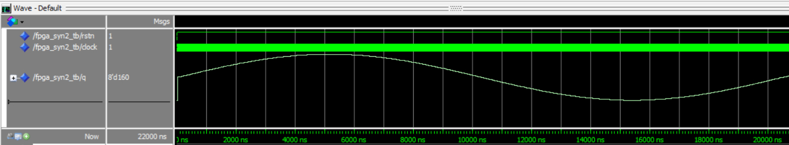
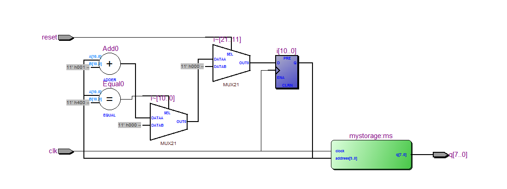
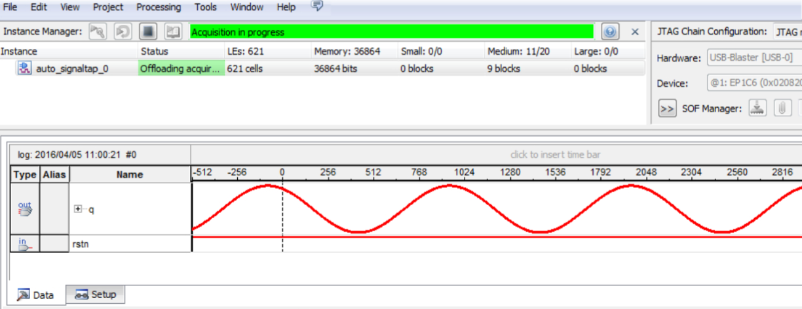

# 实验五、Signal TAP 综合实验

---

#### 邹卫其 PB16061470


## 一、实验目的

- 熟悉 ALTERA IP 核及 Signal TAP II
- 了解 FPGA 基本结构中的存储器
- 熟悉 VHDL test bench 的设计
- 熟练掌握 Altera FPGA 的开发环境、设计步骤和流程


## 二、实验内容

### 正弦信号发生器设计

利用 Matlab 产生一个周期的非负正弦波，然后对其采样，取 1024 点 8 位数据。在QuartusII 中利用 MegaWizard 生成一个 1024*8bits 的存储器（ram/rom），并利用上述正弦波数据来初始化此存储器。编写 VHDL 程序，按一定的方式（如顺序）将存储器中的数据读出并输出到 DA 端口，编译，仿真。最后为工程添加一个 signaltap II 文件，设置参数，编译，无错后下载到目标板，并在 signaltap II 中观看输出到 DA 端口的数据及波形。

- 利用实验室 mystorage.mif 存储器初始化文件
- 创建一个新 Quartus II 工程
- 将存储器初始化文件复制到 Quartus II 工程文件夹下
- 利用 MegaWizard 生成 ROM 或 RAM 存储器

### 顶层模块

```vhdl
library ieee;
use ieee.std_logic_1164.all;
use ieee.std_logic_unsigned.all;
use ieee.std_logic_arith.all;

entity Exp5 is 
	port (
		clk   :in std_logic;
		reset :in std_logic;
		q     :out std_logic_vector (7 downto 0)
	);
end Exp5;

architecture behave of Exp5 is 

component mystorage is 
	port(
		address		: in std_logic_vector (9 downto	0);
		clock		: in std_logic  := '1';
		q		: out std_logic_vector	(7 downto 0)
	);
end component;

	signal i :integer range 0 to 1024;
	signal addr :std_logic_vector (9 downto 0);
begin
	ms: mystorage port map (addr, clk, q);
	process
	begin
		wait until rising_edge(clk);
		if reset = '1' then i <= 0;
		elsif i = 1024 then i <= 0;
		else i <= i + 1;
		end if;
	end process;
	addr <= conv_std_logic_vector(i, 10);
end behave;
```

### test Bench

```vhdl
library ieee;
use ieee.std_logic_1164.all;

entity Exp5_tb is 
end Exp5_tb;

architecture tb of Exp5_tb is
	component Exp5 is
		port (
			clk   :in std_logic;
			reset :in std_logic;
			q     :out std_logic_vector (7 downto 0)
		);
	end component;
	
	signal clk, reset: std_logic;
	signal q: std_logic_vector (7 downto 0);
begin 
	u1: Exp5 port map (clk, reset, q);
	process
	begin
		clk <= '1';
		wait for 10 ns;
		clk <= '0';
		wait for 10 ns;
	end process;
   
	init: process
	begin
		reset <= '0';
		wait for 20 ns;
	end process init;
end tb;
```

### 仿真结果



### RTL 电路



### 硬件验证




