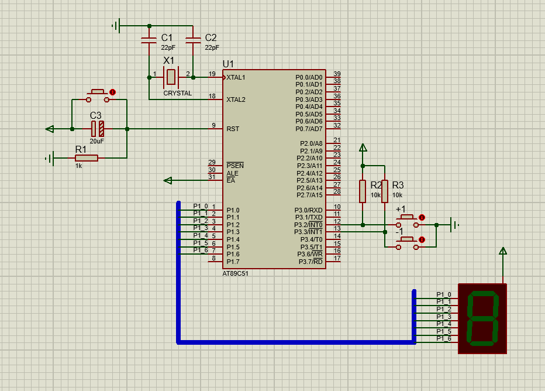
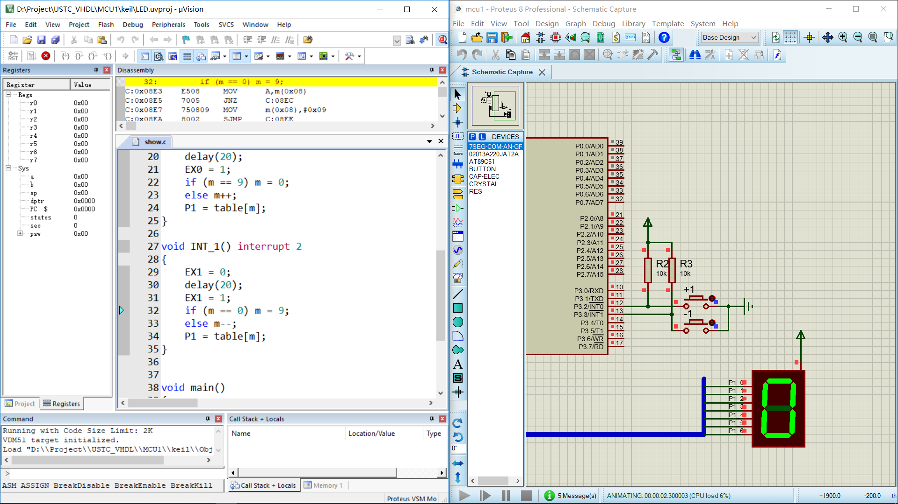

# 单片机实验一

---

#### 邹卫其 PB16061470


## 一、实验目的

- 熟悉 8051 单片机的开发、仿真环境、设计步骤和流程


## 二、实验内容及步骤

### 1、Proteus 创建电路图



### 2、Keil 代码

```c
# include <reg51.h>
# define uchar unsigned char
# define uint  unsigned int
	
uchar code table[] = {0xc0, 0xf9, 0xa4, 0xb0, 0x99, 0x92, 0x82, 0xf8, 0x80, 0x90};
uchar m = 0;

void delay(uchar ms)
{
	uchar i , j;
	for (; ms > 0; ms--)
		for (i = 142; i > 0; i--)
			for (j = 2; j > 0; j--);
}


void INT_0() interrupt 0
{
	EX0 = 0;
	delay(20);
	EX0 = 1;
	if (m == 9) m = 0;
	else m++;
	P1 = table[m];
}

void INT_1() interrupt 2
{
	EX1 = 0;
	delay(20);
	EX1 = 1;
	if (m == 0) m = 9;
	else m--;
	P1 = table[m];
}


void main()
{
	P1 = 0x00;
	EA = 1;
	EX0 = 1;
	IT0 = 1;
	EX1 = 1;
	IT1 = 1;
	
	while (1){}
}
```

### 3、联调



## 三、实验分析

- 8051 单片机，通过 8 位 I/O 输出控制 7 段 LED
- 通过两个按键开关触发外部中断，两外部中断分别对应显示索引的加减
- 通过改变 table[] 索引，P1 赋值，改变输出数字

