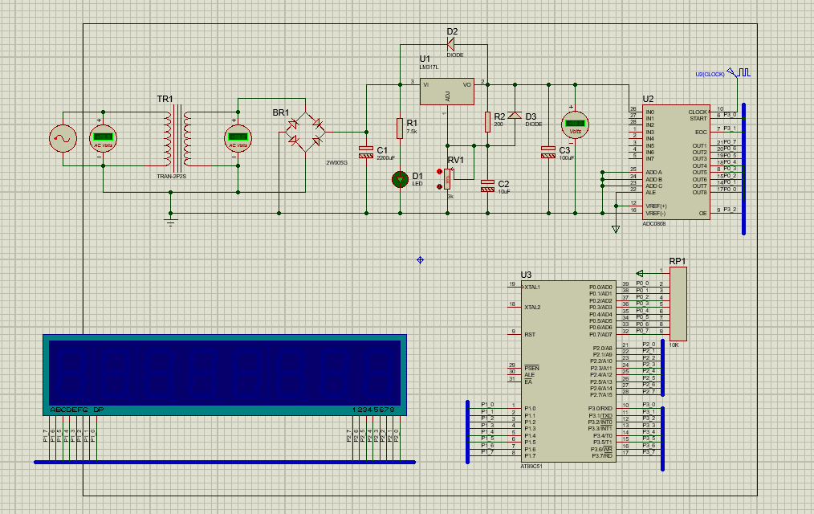
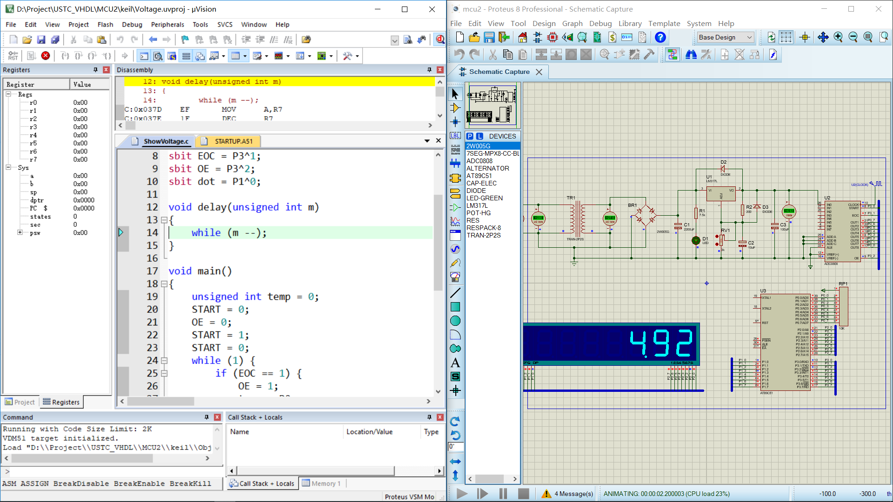

# 单片机实验二

---

#### 邹卫其 PB16061470


## 一、实验目的

- 熟悉 8051 单片机的开发、仿真环境、设计步骤和流程


## 二、实验内容及步骤

### 1、Proteus 创建电路图



### 2、Keil 代码

```c
# include <reg51.h>
# define uint  unsigned int;
# define uchar unsigned char;

uchar code table[] = {0xfc, 0x60, 0xda, 0xf2, 0x66, 0xb6, 0xbe, 0xe0, 0xfe, 0xf6, 0xee, 0x3e, 0x9c, 0x7a, 0x9e, 0x8e};

sbit START = P3^0;
sbit EOC = P3^1;
sbit OE = P3^2;
sbit dot = P1^0;

void delay(unsigned int m)
{
	while (m --);
}

void main()
{
	unsigned int temp = 0;
	START = 0;
	OE = 0;
	START = 1;
	START = 0;
	while (1) {
		if (EOC == 1) {
			OE = 1;
			temp = P0;
			temp = temp * 1.0/255 * 500;
			OE = 0;
			P2 = 0xfe;
			P1 = table[temp % 10];
			delay(500);
			P2 = 0xfd;
			P1 = table[temp/10 % 10];
			delay(500);
			P2 = 0xfb;
			P1 = table[temp/100 % 10];
			dot = 1;
			delay(500);
			START = 1;
			START = 0;
		}
	}
}
```

### 3、联调




## 三、实验分析

- 通过稳压电源产生电路，调整电子原件值，产生合适范围直流电压值
- 对直流电压值采样，P0 获取采样值
- 8051 单片机，通过 8 位 I/O 输出控制 7 段 LED，P2 进行片选，P1 进行输出值的控制